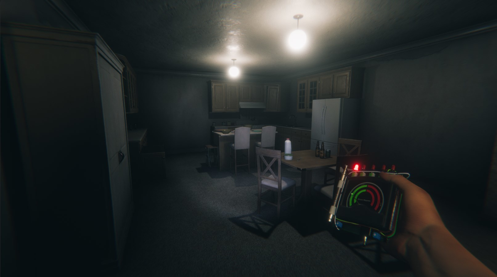

# Ghost Exile Russian Fix for CrossOver

<p align="center">
  
</p>

<p align="center">
  Скрипт для включения и удержания русского языка в <b>Ghost Exile</b>, если игра запущена через <b>Steam</b> внутри <b>CrossOver</b> на macOS.
</p>

<p align="center">
  
  
  
  
</p>

## Зачем нужен этот фикс

У `Ghost Exile` в CrossOver язык может ломаться сразу в нескольких местах:

- Steam хранит один язык
- сама игра читает другое внутреннее значение
- часть локализации ищется по битым alias-папкам

Из-за этого в настройках уже может стоять `Russian`, но интерфейс всё равно остаётся на английском. Скрипт исправляет всю эту цепочку целиком.

## Что делает скрипт

`ghost_exile_ru_crossover.sh`:

- переключает язык игры на `russian` в `appmanifest_1807080.acf`
- обновляет per-user настройки Steam в `localconfig.vdf`
- исправляет внутреннее значение языка в `user.reg` внутри bottle CrossOver
- создаёт fallback-папки локализации, если игра ищет неверные коды языка
- делает `.bak`-копии перед изменениями

Это не фоновый процесс и не daemon. Обычно достаточно одного запуска.

## Кому подойдёт

Скрипт рассчитан на такой сценарий:

- macOS
- CrossOver
- Steam установлен внутри bottle `Steam`
- игра `Ghost Exile`
- в меню выбран `Russian`, но часть интерфейса всё ещё на английском

## Быстрый старт

```bash
git clone https://github.com/TechnologyUniverse/ghost-exile-ru-crossover.git
cd ghost-exile-ru-crossover
chmod +x ghost_exile_ru_crossover.sh
./ghost_exile_ru_crossover.sh --kill-steam --start-steam
```

Если хочешь сначала просто проверить изменения без записи:

```bash
./ghost_exile_ru_crossover.sh --dry-run --kill-steam
```

## После запуска

1. Дождись завершения скрипта.
2. Запусти `Ghost Exile` заново.
3. Открой настройки языка в игре.
4. Если уже выбран `Russian`, нажми `Apply`.

## Аргументы

- `--dry-run` - показать изменения без записи
- `--kill-steam` - закрыть Steam/CrossOver bottle перед правками
- `--start-steam` - запустить Steam снова после правок
- `--bottle PATH` - указать нестандартный путь к bottle

## Скриншоты игры

<p align="center">
  
  
</p>

<p align="center">
  
  
</p>

## Какие файлы затрагиваются

- `steamapps/appmanifest_1807080.acf`
- `userdata/*/config/localconfig.vdf`
- `user.reg` внутри CrossOver bottle
- `GhostExile_Data/StreamingAssets/LoreNote/*`
- `GhostExile_Data/StreamingAssets/Ouija/*`

## Безопасность

- перед изменениями создаются резервные копии
- повторный запуск безопасен
- если всё уже исправлено, лишние шаги будут пропущены

## Примечание

Скриншоты в этом репозитории взяты из официальных материалов `Ghost Exile` в Steam и используются здесь только для оформления README.
